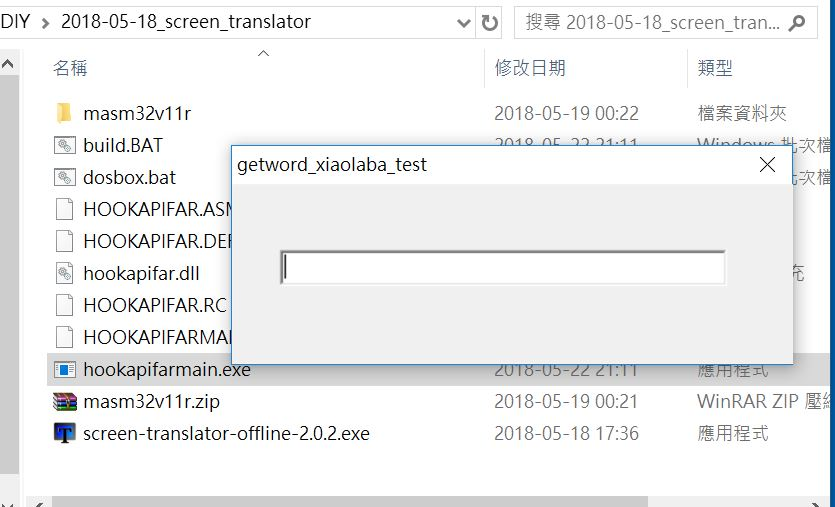

# masm32_win10_screen_capture_text
Study for win32 hook api for text capture from screen (屏幕取詞)

Source code was copy from couple webpages, they are almost identical thus just another copy cat with exact error, no build could be done. Two ASM source files are included and notes with those URLs. My attempts and at least fixed some errors of build script (build.bat) / DEF / RC. changed the caption string to see if it wroks, then nothing else.

## Tools:
masm32 SDK, free copy is here, http://www.masm32.com/

## How to build:
Win 10, 64 bit, just click build.bat, should be self-explanatory.
win7/8 or any win32 platform should be the same, but no test yet.
Once build (assembly & link) is done, one dll and one exe are produced.

## Status:
build success, but no text captured or output.
download the soruce and exe/dll here, https://github.com/xiaolaba/masm32_win10_screen_capture_text/releases/tag/masm32_win10_screen_capture_text_rev1

run and result like this,

## The Next:
await for comments and suggestions. see if anyone will helps out,

http://masm32.com/board/index.php?topic=7163.msg77388#msg77388

http://www.programmer-club.com.tw/ShowSameTitleN/assembly/9309.html
  
